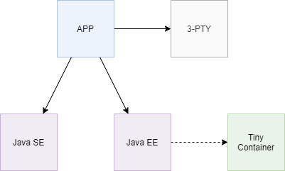
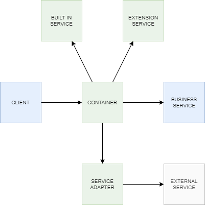

# Tiny Container
Light weight Java EE compliant, modular container for solutions where size and code reuse matters. Code reuse is promoted by reducing application dependencies; in fact one can create a functional application using only Java SE and Tiny Container services exposed by standard JEE annotations. Of course for complex applications third party dependencies are required.



This code snippet is functional and has no dependency on Tiny Container. It can be moved without changes into another application server.

```
import javax.annotation.PostConstruct;
import javax.annotation.PreDestroy;
import javax.annotation.Resource;
import javax.annotation.security.RolesAllowed;
import javax.ejb.Asynchronous;
import javax.ejb.Remote;
import javax.ejb.Schedule;
import javax.ejb.Startup;
import javax.inject.Inject;

@Remote
@RolesAllowed("admin")
@Startup
public class AppService {
	@Resource(name = "service.name")
	private String name;

	@Inject
	private AppWorker worker;
	
	@PostConstruct
	public void postConstruct() { }

	@PreDestroy
	public void preDestroy() { }

	@Asynchronous
	public void process() { }

	@Schedule(minute = "30", hour = "4")
	private void timer() { }
}
```

Since application consumes container services via Java standard annotations it can replace Tiny Container without source code changes. There is no direct dependencies from application to Tiny Container implementation.

Tiny Container is designed to be embedded into standalone applications. Because it is so small it can be distributed in application archive.

```
public class Main {
	public static void main(String... args) throws Exception {
		AppContainer.create(new Module()).getInstance(Main.class).execute();
	}

	private final IService service;

	@Inject
	private Main(IService service) {
		this.service = service;
	}

	private void execute() throws Exception {
		service.business();
	}
}	
```

