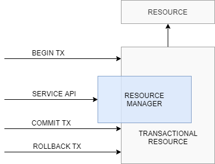

# Transactional Resource

External resource that provides a transactional API. A transactional resource has two kinds of APIs: one exposed by resource manager that deals with specific services and one for managing transactions, accessible via {@link Transaction} interface.

A resource is a program object that provides connections to such systems as database servers and messaging systems. A resource manager facilitates interaction with a resource. For example, on Hibernate resource manager is the `org.hibernate.Session` interface whereas on JPA is the `javax.persistence.EntityManager` interface. Both interfaces offer methods for database CRUD tasks and a method to retrieve a transaction instance - `org.hibernate.Transaction`, respective `javax.persistence.EntityTransaction`. 

Service API is executed inside transactional boundaries managed by transaction API. When transaction object is retrieved from transaction manager, it also contains session object.

Transactional resource stores session object on current thread - see {@link #storeSession(Object)}, so that managed method implemented by application can get session and execute service API on it.



After application managed method finishes its execution transaction is closed and session object is discarded from thread local. Anyway, for nested transactions, {@link #releaseSession()} is executed only after outermost transaction was closed.

Sequence diagram for transaction and session object interaction. It is a simplified version and does not cover {@link TransactionManager} and {@link TransactionContext} interfaces.

```
 +---------------+  +---------------------+  +-----------------------+  +-------------+  +---------+
 | ManagedMethod |  | ManagedProxyHandler |  | TransactionalResource |  | Transaction |  | Session |
 +-------+-------+  +-----------+---------+  +-------------+---------+  +------+------+  +----+----+
         |     invoke           |                          |                   |              |
 ~------------------------------>   createTransaction      |   new             |              |      
         |                      +-------------------------->------------------->              |
         |                      |   storeSession           |                   |              |           
         |                      +-------------------------->                   |              |
         |     getSession       |                          |                   |              |
         <-------------------------------------------------+                   |              |
         |     service API      |                          |                   |              |
         +------------------------------------------------------------------------------------>
         |                      |   commit                 |                   |              |
         |                      +---------------------------------------------->              |
         |                      |   close                  |                   |              |
         |                      +---------------------------------------------->              |
         |                      |   releaseSession         |                   |              |
         |                      +-------------------------->                   |              |
         |                      |                          |                   |              |
```

This interface is for container internals and should not be used by applications; it is public for testing support.

For special needs transactional resource allows for manual transaction management. This is accomplished by delegating underlying transaction manager, see {@link TransactionManager#exec(js.transaction.WorkingUnit, Object...)}. In sample code, transactional resource creates and configures the transaction manager that takes care to execute {@link WorkingUnit} inside transaction boundaries.

```
TransactionalResource transactionalResource = Factory.getInstance(TransactionalResource.class);
TransactionManager transactionManager = transactionalResource.getTransactionManager();

Address address = transactionManager.exec(new WorkingUnit&lt;Session, Address&gt;() {
  public Address exec(Session session, Object... args) throws Exception {
    Person person = (Person)args[0];
    SQLQuery sql = session.createSQLQuery("SELECT * FROM address ...");
    ...
    return (Address)sql.uniqueResult();
  }
}, person);
```
